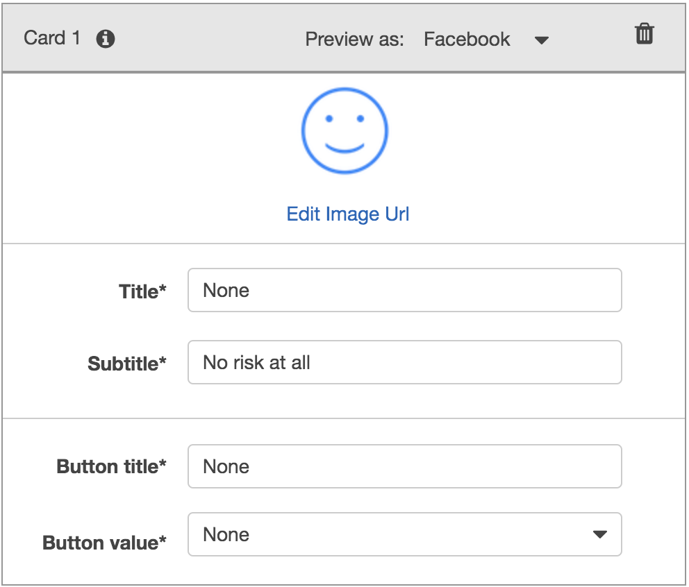

# Unit13-challenge

## Unit 13 Homework Assignment - The Power of the Cloud and Unsupervised Learning

## Option 1: Robo Advisor for Retirement Plans

*Photo by [Alex Knight](https://www.pexels.com/@alex-knight-1272316?utm_content=attributionCopyText&utm_medium=referral&utm_source=pexels) from [Pexels](https://www.pexels.com/photo/high-angle-photo-of-robot-2599244/?utm_content=attributionCopyText&utm_medium=referral&utm_source=pexels) | [Free License](https://www.pexels.com/photo-license/)*

### Background

You were hired as a digital transformation consultant by one of the most prominent retirement plan providers in the country; they want to increase their client portfolio, especially by engaging young people. Since machine learning and NLP are disrupting finance to improve customer experience, you decide to create a robo advisor that could be used by customers or potential new customers to get investment portfolio recommendations for retirement.

In this homework assignment, you will combine your new Amazon Web Services skills with your already mastered Python superpowers, to create a bot that will recommend an investment portfolio for a retirement plan.

You are asked to accomplish the following main tasks:

1. Initial Robo Advisor Configuration: Define an Amazon Lex bot with a single intent that establishes a conversation about the requirements to suggest an investment portfolio for retirement.

2. Build and Test the Robo Advisor: Make sure that your bot is working and responding accurately along with the conversation with the user, by building and testing it.

3. Enhance the Robo Advisor with an Amazon Lambda Function: Create an Amazon Lambda function that validates the user's input and returns the investment portfolio recommendation. This task includes testing the Amazon Lambda function and making the integration with the bot.

---

### Instructions

#### Initial Robo Advisor Configuration

In this section, I have created the RoboAdvisor bot and added an intent with its corresponding slots as below data and parameters:

* **Bot name:** RoboAdvisor
* **Output voice**: Salli
* **Session timeout:** 5 minutes
* **Sentiment analysis:** No
* **COPPA**: No
* **Advanced options**: No
* *Leave default values for all other options.*

I have created the RecommendPortfolio intent, and configured some sample utterances as belows:

* I want to save money for my retirement
* I'm ​`{age}​` and I would like to invest for my retirement
* I'm `​{age}​` and I want to invest for my retirement
* I want the best option to invest for my retirement
* I'm worried about my retirement
* I want to invest for my retirement
* I would like to invest for my retirement

**[RecommendPortfolio_Export](#RecommendPortfolio_Export):**

I have then used the below info to create four slots, three using built-in types and one custom slot named `riskLevel`:

| Name             | Slot Type            | Prompt                                                                    |
| ---------------- | -------------------- | ------------------------------------------------------------------------- |
| firstName        | AMAZON.US_FIRST_NAME | Thank you for trusting me to help, could you please give me your name? |
| age              | AMAZON.NUMBER        | How old are you?                                                          |
| investmentAmount | AMAZON.NUMBER        | How much do you want to invest?                                           |

I have created four cards for the riskLevel slot:

Configure the response cards for the `riskLevel` slot as is shown bellow:

| Card 1                              | Card 2                              |
| ----------------------------------- | ----------------------------------- |
|   |   |

| Card 3                              | Card 4                              |
| ----------------------------------- | ----------------------------------- |
|   |   |

**[riskLevel_Export](#RoboAdvisor/Starter_Files/riskLevel_Export):**

### Build and Test the Robo Advisor:

In this section, I have tested my Robo Advisor. 
 

---
## Enhance the Robo Advisor with an Amazon Lambda Function

In this section, I have ran the Amazon Lambda function that will validate the data provided by the user on the Robo Advisor.

##### Validation Data:

* The `age` should be greater than zero and less than 65.
* the `investment_amount` should be equal to or greater than 5000.

##### Investment Portfolio Recommendation:

Once the intent is fulfilled, the bot will response with an investment recommendation based on the selected risk level as follows:

* **none:** "100% bonds (AGG), 0% equities (SPY)"
* **very low:** "80% bonds (AGG), 20% equities (SPY)"
* **low:** "60% bonds (AGG), 40% equities (SPY)"
* **medium:** "40% bonds (AGG), 60% equities (SPY)"
* **high:** "20% bonds (AGG), 80% equities (SPY)"
* **very high:** "0% bonds (AGG), 100% equities (SPY)"

**[lambda_function](#lambda_function):**

After successfully testing the code, I opened the Amazon Lex Console and navigated to the `RecommendPortfolio`.

**[RoboAdvisor_Export](#RoboAdvisor_Export):**

